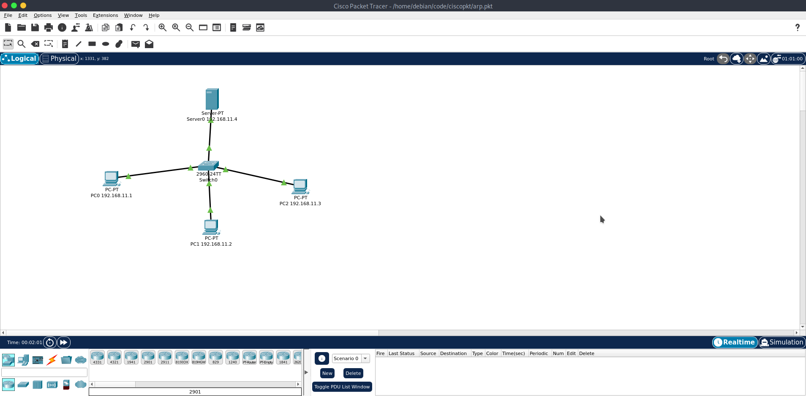
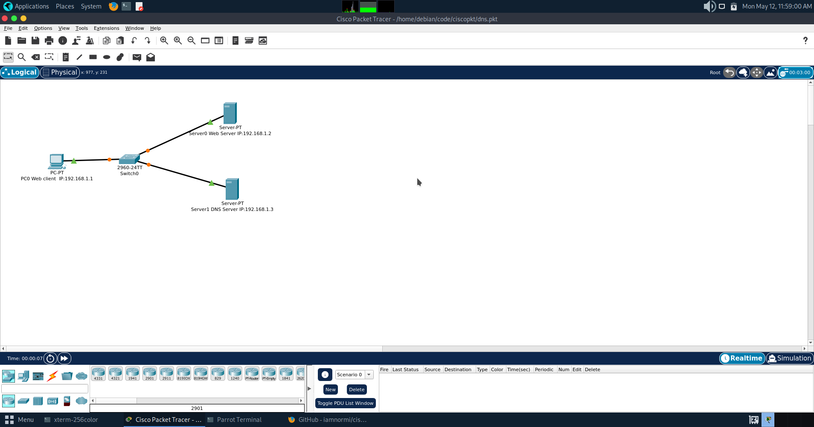
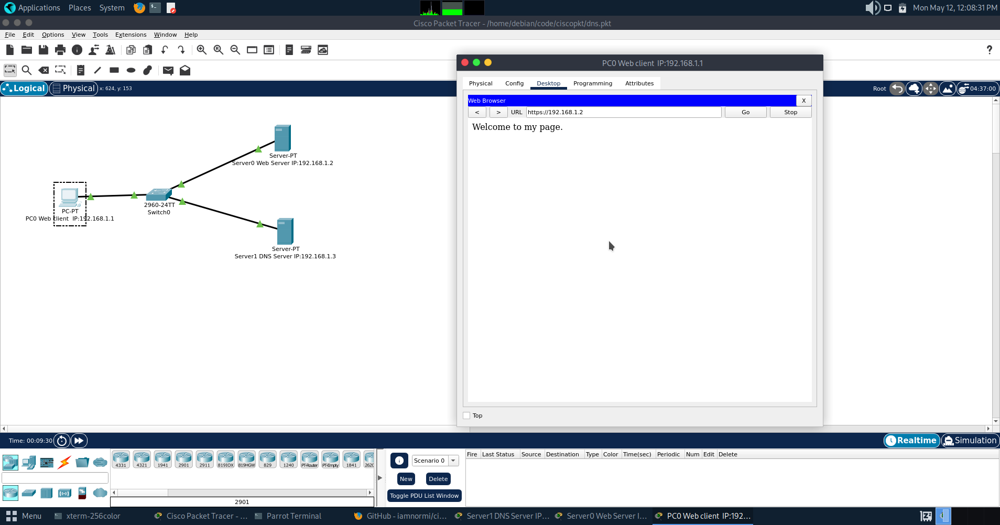
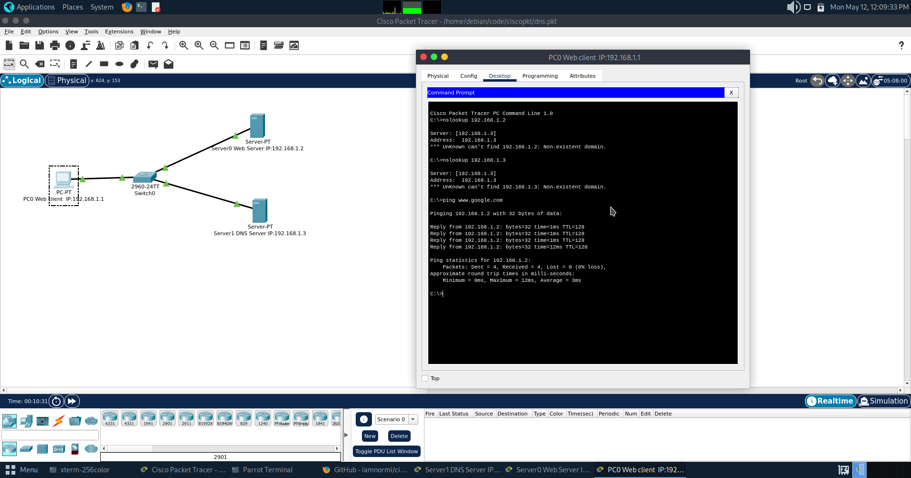
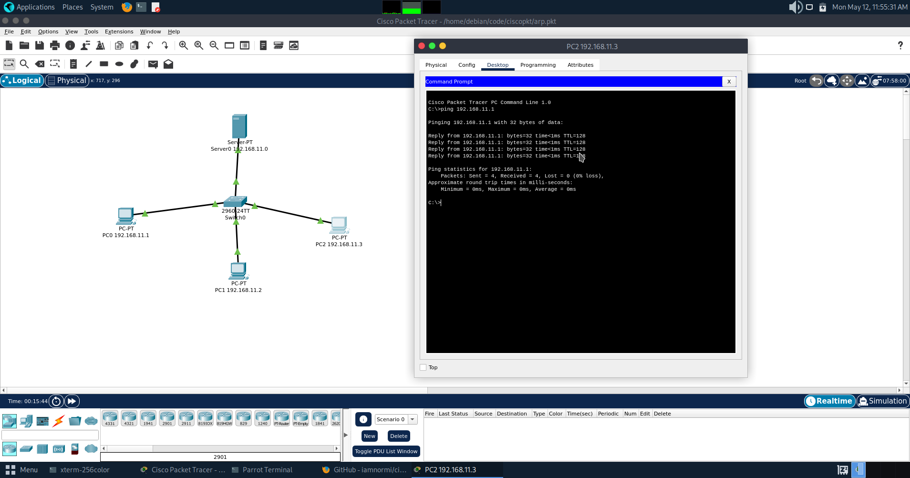

# ciscopkt
My Cisco Packet Tracer Network stimulation save files.
## Output from ARP:

## Output from DNS:

### Output from Ping:

## Dev = 1'43
These codes was maintained by [**iamNormi**](https://github.com/iamNormi).

 |
--- |
[iamNormi](https://github.com/iamNormi) |

## License

[GNU GENERAL PUBLIC LICENSE](./LICENSE)

